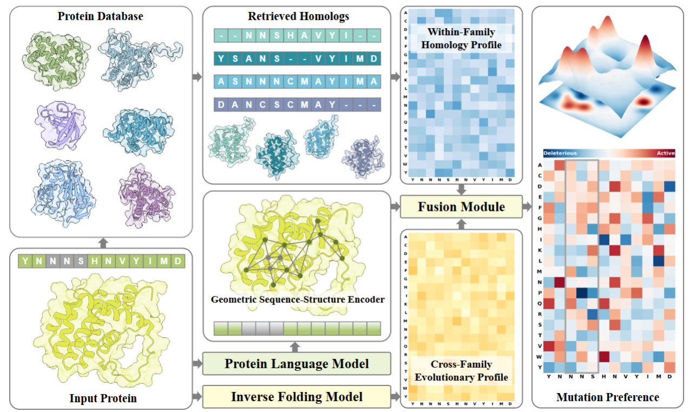
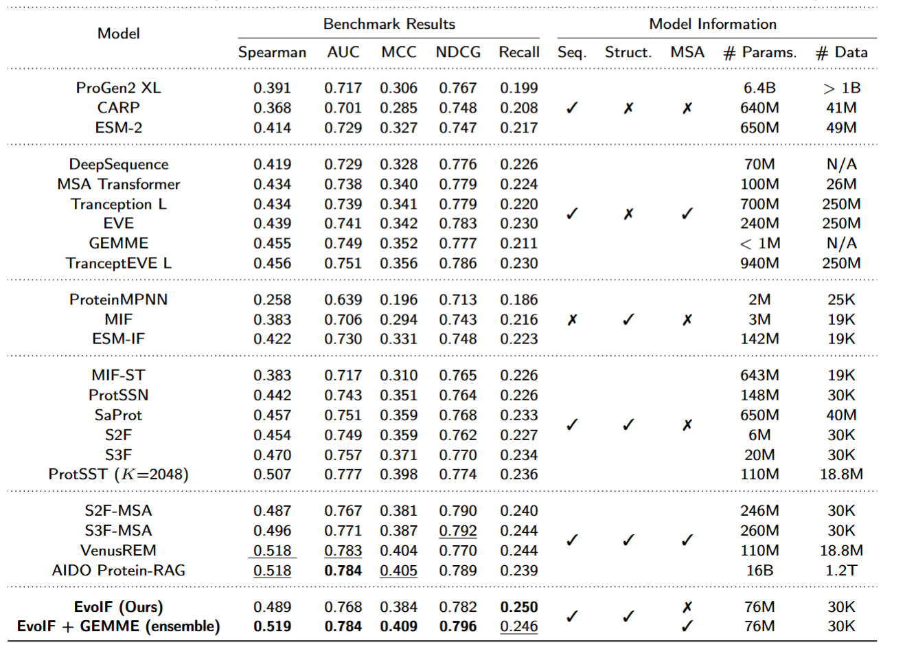

# Evolutionary Profiles for Protein Fitness Prediction (EvoIF)

This is the official codebase of the paper:

**Evolutionary Profiles for Protein Fitness Prediction**

[[ArXiv](https://arxiv.org/abs/2510.07286)]

## Overview

Predicting the fitness impact of mutations is central to protein engineering but constrained by limited assays relative to the size of sequence space. **EvoIF** provides a unifying view by interpreting natural evolution as implicit reward maximization and masked language modeling (MLM) as inverse reinforcement learning (IRL).

Building on this perspective, EvoIF is a lightweight model that integrates two complementary sources of evolutionary signal: 
1. **Within-family profiles** from retrieved homologs.
2. **Cross-family structural-evolutionary constraints** distilled from inverse folding logits.

By fusing sequence-structure representations with these profiles via a compact fusion module, EvoIF and its MSA-enabled variant achieve state-of-the-art or competitive zero-shot fitness prediction on the ProteinGym benchmark (217 mutational assays; >2.5M mutants). Notably, it achieves this while using only **0.15% of the training data** and fewer parameters than recent large models.



This codebase is based on PyTorch and [TorchDrug](https://github.com/DeepGraphLearning/torchdrug) ([TorchProtein](https://torchprotein.ai)).

## 🏆 ProteinGym Benchmark Results

EvoIF achieves **state-of-the-art or competitive performance** on ProteinGym (217 DMS assays, >2.5M mutants) with **only 0.15% training data** compared to large-scale pLMs as seen on the comparison.


**Key advantages:**
- ✅ **Best efficiency**: Matches SOTA performance with **76M params vs. 16B** 
- ✅ **Best data efficiency**: Uses **30K samples vs. 1.2T** 
- ✅ **Best MSA-free model**: 0.489 Spearman without MSA (vs. 0.470 S3F, 0.454 S2F)
- ✅ **SOTA with ensemble**: 0.519 Spearman with GEMME ensemble
## Environment
### Clone the repository
```bash
git clone https://github.com/EvoIF/EvoIF.git
cd EvoIF

```
### Prepare the environment
```bash
conda env create -f environment.yml
conda activate evoif
```

## Evaluate on ProteinGym benchmark

### Dataset preparation 
To evaluate on ProteinGym benchmark, you need to first download datasets from the [official ProteinGym website](https://proteingym.org/).
```bash
# Download ProteinGym benchmark
wget https://marks.hms.harvard.edu/proteingym/DMS_ProteinGym_substitutions.zip -O data/proteingym/DMS_ProteinGym_substitutions.zip
unzip data/proteingym/DMS_ProteinGym_substitutions.zip -d data/proteingym/DMS_ProteinGym_substitutions

# Download PDB files and pre-computed evolutionary profiles 
tar -xzf data/proteingym/pdbs.tar.gz -C data/proteingym
tar -xzf data/proteingym/struc_seq_aln_foldseek.tar.gz -C  data/proteingym
tar -xzf data/proteingym/gym_ifprobs.tar.gz -C data/proteingym

```

As the model is based on the ESM-2-650M model, you need to first download the ESM model checkpoint.
```bash
mkdir -p esm-model-weights/ 
wget https://dl.fbaipublicfiles.com/fair-esm/models/esm2_t33_650M_UR50D.pt -P  esm-model-weights/
```
There is a `task.model.sequence_model.path` argument in each config file to control where to automatically download ESM model weights. Please modify this to your customized path to the esm model weights.


### Evaluation

We provide EvoIF  checkpoints for evaluation. You can download these checkpoints from [link](https://file.kiwi/0c6ab7cf#wIHNIf_PBkUBJMErhqemmA) and then run the following commands for evaluation. Right now, we only support single-gpu evaluation, which takes around 1h 12m  for all 217 assays on one H800 GPU. The output files can be found at `./scratch/proteingym_output`, which is specified by the `output_dir` argument in the `*.yaml`.

```bash

# Run evaluation for EvoIf
python script/evaluate.py -c $(pwd)/config/evaluate.yaml   --datadir  $(pwd)/data/proteingym/DMS_ProteinGym_substitutions --structdir $(pwd)/data/proteingym/pdbs   --struc_align_dir $(pwd)/data/proteingym/struc_seq_aln_foldseek --if_profile_dir $(pwd)/data/proteingym/gym_ifprobs --profile_types "['struc_profile','if_profile']"  --ckpt $(pwd)/ckpt/evoif.pth
```


## Pre-train on CATH dataset

### Dataset preparation 
Download the raw CATH dataset and preprocess the PDB files for training.
```bash
mkdir data/cath

# Download raw cath dataset and process it
wget https://huggingface.co/datasets/tyang816/cath/blob/main/dompdb.tar -P data/cath
tar -xvf data/cath/dompdb.tar -C data/cath
#processed the pdbs for training
python script/preload_dataset.py -i data/cath/dompdb/ -o data/cath/processed_dompdb/
#processed the pdbs folder
python script/processed_files.py --dir data/cath/dompdb/
```
Extract Evolutionary Profiles.We use Foldseek(https://github.com/steineggerlab/foldseek) and ProteinMPNN(https://github.com/dauparas/ProteinMPNN) to extract within-family and cross-family signals.For detailed documentation, please visit their official repositories.
```bash

# install Foldseek
conda install -c conda-forge -c bioconda foldseek

# 1.Within-family: Structural MSAs (Foldseek)
# Search homologous structures from AlphaFold DB
mkdir data/cath/foldseek
mkdir data/cath/foldseek/af_db
foldseek databases Alphafold/Proteome data/cath/af_db/afdb  data/cath/foldseek/tmp
foldseek createdb data/dompdb/ data/cath/foldseek/queryDB
foldseek search data/cath/foldseek/queryDB data/cath/foldseek/af_db/afdb data/cath/foldseek/aln data/cath/foldseek/tmpFolder -a 
foldseek result2msa data/cath/foldseek/queryDB data/cath/foldseek/af_db/afdb data/cath/foldseek/aln data/cath/foldseek/msa --msa-format-mode 6
 foldseek unpackdb data/cath/foldseek/msa data/cath/foldseek/struc --unpack-suffix a3m --unpack-name-mode 0
# Process MSAs for EvoIF input
python thirdparty/struc_align.py --input_dir data/cath/foldseek/struc --output_dir data/cath/foldseek/processed_struc

#2.Cross-family: Inverse Folding (ProteinMPNN)
bash third_party/ProteinMPNN/submit_example_7.sh -i data/cath/dompdb -o data/cath/ifprobs
python third_party/process_pssm.py --pdb_dir data/cath/dompdb --npz_dir data/cath/ifprobs/unconditional_probs_only --output_dir data/cath/processed_ifprobs
 ```

Preload training datasets
```bash

  
python preload_cath_dataset.py --input_path data/cath/processed_dompdb --output_path data/cath/processed_cath --struc_align_path data/cath/foldseek/processed_struc --if_profile_path data/cath/processed_ifprobs --max_length 512 --profile_types if_profile struc_profile

```
### Pre-train EvoIF model on cath dataset

To pre-train the EvoIF models, please run the following commands. Here we use 4 H800 GPUs for training. 
```bash

python -m torch.distributed.launch --nproc_per_node=4 script/pretrain.py     -c $(pwd)/config/pretrain.yaml     --preload_dir $(pwd)/data/cath/processed_cath     --datadir $(pwd)/data/cath/processed_dompdb     --struc_align_dir $(pwd)/data/cath/foldseek/processed_struc     --if_profile_dir $(pwd)/data/cath/processed_ifprobs     --profile_types "['struc_profile','if_profile']"

```
To customize your pre-training setting, you need to adapt config/pretrain.yaml for your setting. You can set engine.gpus as the devices you want to use and set engine.batch_size as the batch size per gpu


## License

This project is licensed under the MIT License - see the [LICENSE](LICENSE) file for details.

## Citation
If you find this codebase useful in your research, please cite the following papers.

```bibtex
@article{fan2025evolutionary,
  title={Evolutionary Profiles for Protein Fitness Prediction},
  author={Fan, Jigang and Jiao, Xiaoran and Lin, Shengdong and Liang, Zhanming and Mao, Weian and Jing, Chenchen and Chen, Hao and Shen, Chunhua},
  journal={arXiv preprint arXiv:2510.07286},
  year={2025}
}
```